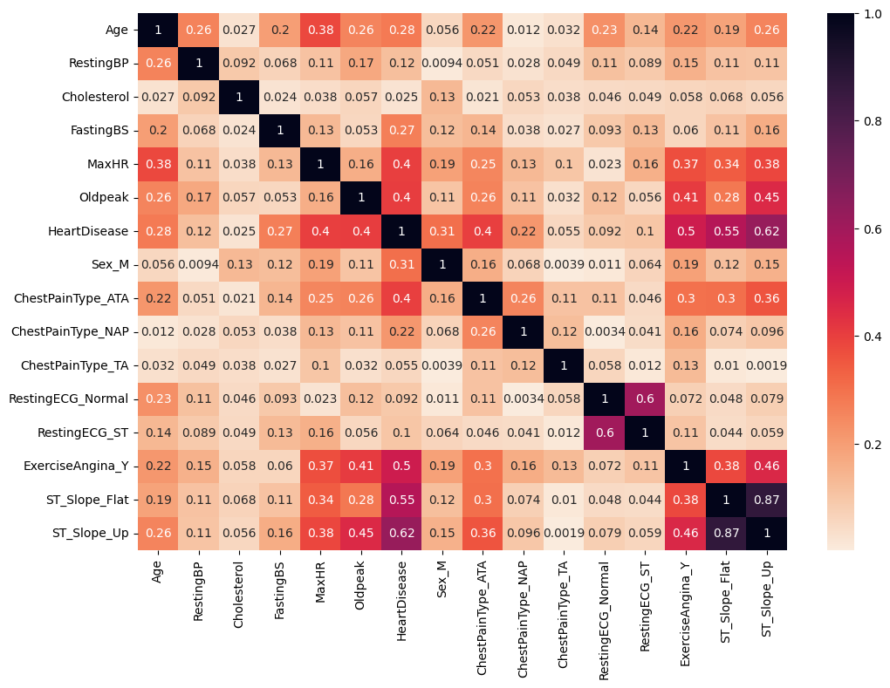
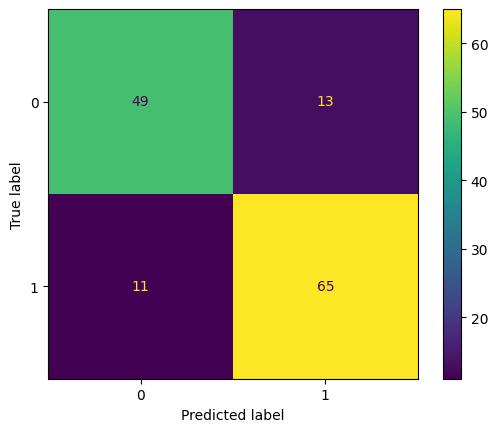

# 🫀 Predicción de Enfermedad Cardíaca con K-Nearest Neighbors (KNN)

Este proyecto utiliza técnicas de Machine Learning para predecir la presencia de enfermedades cardíacas en pacientes basándose en atributos médicos como la presión arterial, niveles de colesterol y resultados de electrocardiogramas.

## 📌 Descripción del Proyecto

El objetivo principal es construir un modelo clasificador capaz de identificar pacientes con riesgo de cardiopatía. Se implementó un flujo de trabajo completo de Data Science, poniendo énfasis en la **limpieza de datos** (tratamiento de valores cero en Colesterol y Presión Arterial) y la **optimización del modelo** mediante Validación Cruzada y GridSearch.

## 🛠️ Tecnologías Utilizadas

* **Python** (Pandas, NumPy)
* **Visualización:** Matplotlib, Seaborn
* **Machine Learning:** Scikit-learn (KNN, GridSearchCV, Cross-Validation)
* **Preprocesamiento:** One-Hot Encoding, MinMaxScaler, StandardScaler

## 📊 Análisis Exploratorio y Limpieza

Durante la fase de exploración (EDA), se identificaron y corrigieron anomalías en los datos:
* **Inconsistencias:** Se detectaron 172 registros con `Cholesterol = 0` y 1 registro con `RestingBP = 0`.
* **Solución:** Se realizó una imputación de datos utilizando la **mediana** calculada separadamente para grupos con y sin cardiopatía, mejorando la calidad del dataset para el entrenamiento.

### Hallazgos Clave
El análisis de correlación y pruebas de características individuales revelaron que los predictores más fuertes son:
1.  **ST_Slope_Up / Flat:** La pendiente del segmento ST en el ECG.
2.  **ExerciseAngina:** Angina inducida por el ejercicio.
3.  **Oldpeak:** Depresión del ST inducida por el ejercicio.


*(Asegúrate de guardar tu heatmap en la carpeta images y enlazarlo aquí)*

## 🧠 Desarrollo del Modelo (KNN)

Se evaluó el algoritmo K-Nearest Neighbors con diferentes configuraciones:

1.  **Prueba Univariante:** Se probó el poder predictivo de cada variable por separado. `ST_Slope_Up` logró un 84% de accuracy por sí sola.
2.  **Validación Cruzada:** Se utilizó 5-fold Cross-Validation para validar la estabilidad de las variables, confirmando que la pendiente ST y la Angina son determinantes.
3.  **Modelo Multivariable Optimizado:**
    * Se escalaron las características usando `MinMaxScaler`.
    * Se utilizó `GridSearchCV` para encontrar los hiperparámetros óptimos.
    * **Mejores parámetros:** `{'metric': 'manhattan', 'n_neighbors': 11}` (ejemplo basado en tu output).

## 📈 Resultados

El modelo final optimizado alcanzó una precisión (accuracy) sólida en el conjunto de prueba.

* **Accuracy en Test Set:** ~84% - 87% (Dependiendo de la ejecución final)
* **Matriz de Confusión:**



## 🚀 Cómo ejecutar este proyecto

1. Clonar el repositorio.
2. Instalar dependencias:
   ```bash
   pip install -r requirements.txt